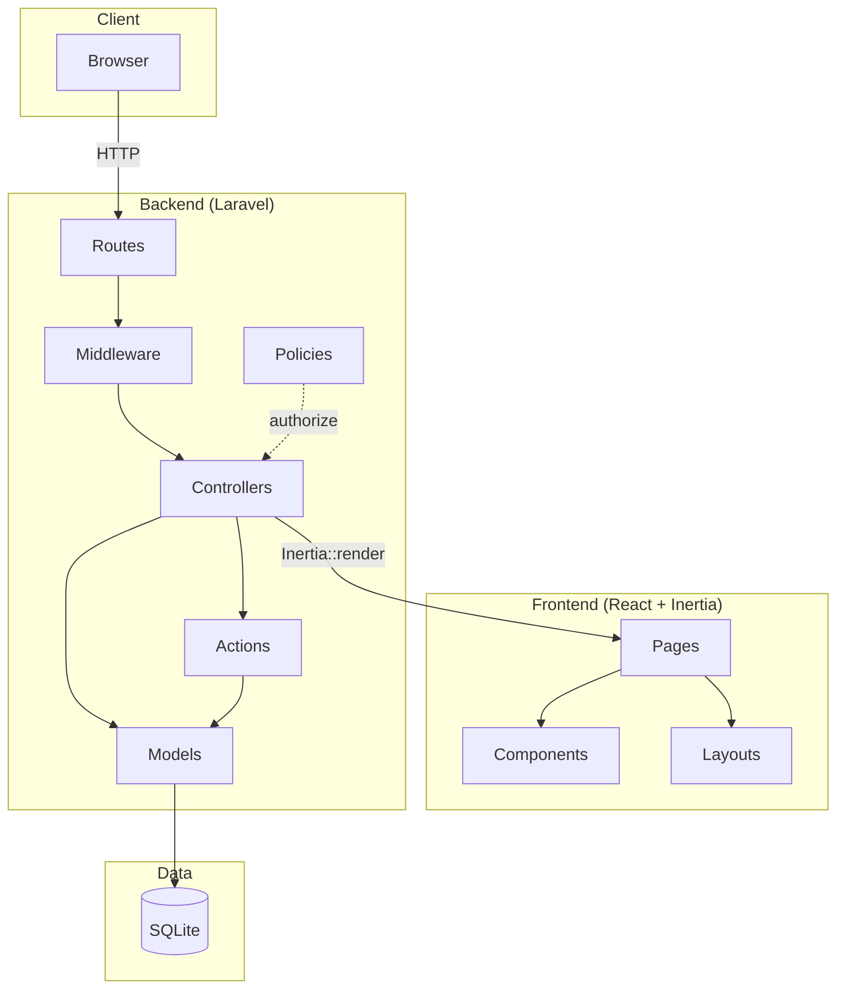
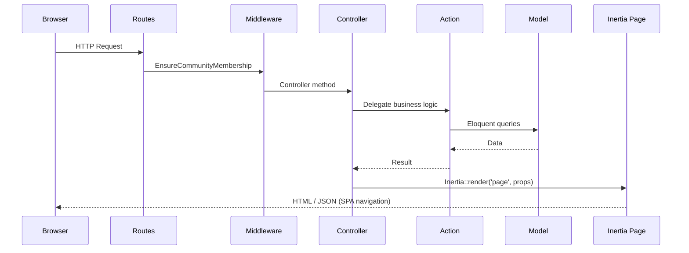
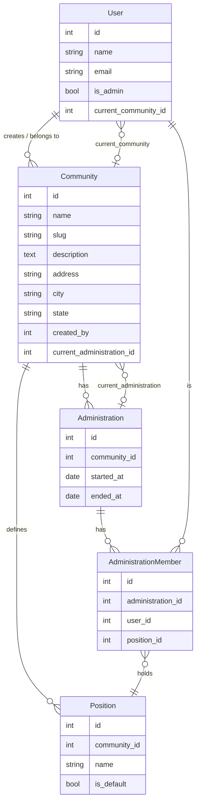

# Architecture

This document describes the high-level architecture, folder structure, and key design decisions of the Community application.

## Tech Stack

| Layer    | Technology                                 |
| -------- | ------------------------------------------ |
| Backend  | PHP 8.5, Laravel 13                        |
| Frontend | React 19, Inertia.js v3                    |
| Styling  | Tailwind CSS v4                            |
| Database | SQLite (default)                           |
| Testing  | Pest v4                                    |
| Build    | Vite + Wayfinder                           |
| Auth     | Laravel Fortify (passwords, 2FA, passkeys) |

## High-Level Architecture



## Request Lifecycle



## Domain Model



## Roles & Authorization

Community membership uses the `CommunityRole` enum with three levels:

| Role        | Description                     |
| ----------- | ------------------------------- |
| `president` | Full control over the community |
| `admin`     | Administrative privileges       |
| `member`    | Standard member access          |

Authorization is enforced via **Policies** (`CommunityPolicy`, `AdministrationPolicy`, `PositionPolicy`).

## Folder Structure

```
community/
├── app/
│   ├── Actions/                # Business logic (single-responsibility classes)
│   │   ├── Administrations/    #   CreateAdministration, AssignMemberToPosition
│   │   ├── Communities/        #   CreateCommunity
│   │   └── Fortify/            #   Auth actions (registration, password, 2FA)
│   ├── Concerns/               # Traits (HasCommunities, GeneratesUniqueSlugs, ...)
│   ├── Console/                # Artisan commands
│   ├── Data/                   # Data transfer objects
│   ├── Enums/                  # CommunityRole
│   ├── Http/
│   │   ├── Controllers/
│   │   │   ├── Api/            #   BrasilApiController
│   │   │   ├── Communities/    #   Community, Administration, Position controllers
│   │   │   └── Settings/       #   Profile, Security controllers
│   │   ├── Middleware/         # EnsureCommunityMembership, HandleInertiaRequests
│   │   └── Requests/           # Form request validation
│   ├── Models/                 # Eloquent models (User, Community, Administration, ...)
│   ├── Notifications/          # Email / notification classes
│   ├── Policies/               # Authorization policies
│   ├── Providers/              # Service providers
│   └── Rules/                  # Custom validation rules
├── resources/js/
│   ├── pages/                  # Inertia page components
│   │   ├── auth/               #   Login, Register, Forgot/Reset password, Verify email
│   │   ├── communities/        #   Index, Edit, Onboarding, Administrations, Positions
│   │   ├── settings/           #   Profile, Security, Appearance
│   │   ├── dashboard.tsx
│   │   └── welcome.tsx
│   ├── components/             # Reusable React components + ui/ primitives
│   ├── layouts/                # App, Auth, and Settings layouts
│   ├── hooks/                  # Custom React hooks
│   ├── lib/                    # Utility functions
│   ├── types/                  # TypeScript type definitions
│   ├── actions/                # Wayfinder generated controller actions
│   └── routes/                 # Wayfinder generated named routes
├── routes/
│   ├── web.php                 # Web routes
│   ├── settings.php            # Settings routes
│   └── console.php             # Console routes
├── database/                   # Migrations, factories, seeders
├── config/                     # Laravel configuration files
├── tests/
│   ├── Feature/                # Feature tests (Auth, Communities, Administrations, ...)
│   └── Unit/                   # Unit tests
├── docs/                       # Documentation and wireframes
└── public/                     # Public assets
```

## Key Patterns

- **Action classes** encapsulate business logic, keeping controllers thin.
- **Inertia.js** bridges Laravel and React -- no separate API layer needed for the SPA.
- **Wayfinder** auto-generates typed TypeScript functions for routes and controller actions.
- **Multi-tenancy** is handled via `current_community_id` on the User model and the `EnsureCommunityMembership` middleware.
- **Fortify** provides authentication (login, registration, password reset, email verification, 2FA, passkeys) with no frontend opinions.
