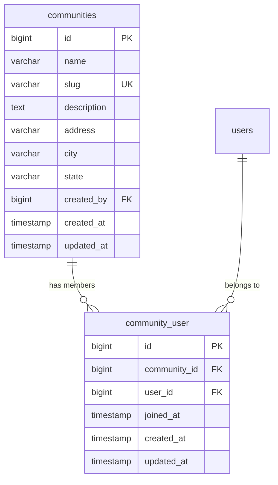
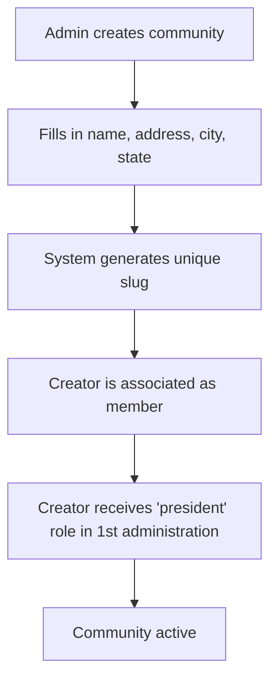
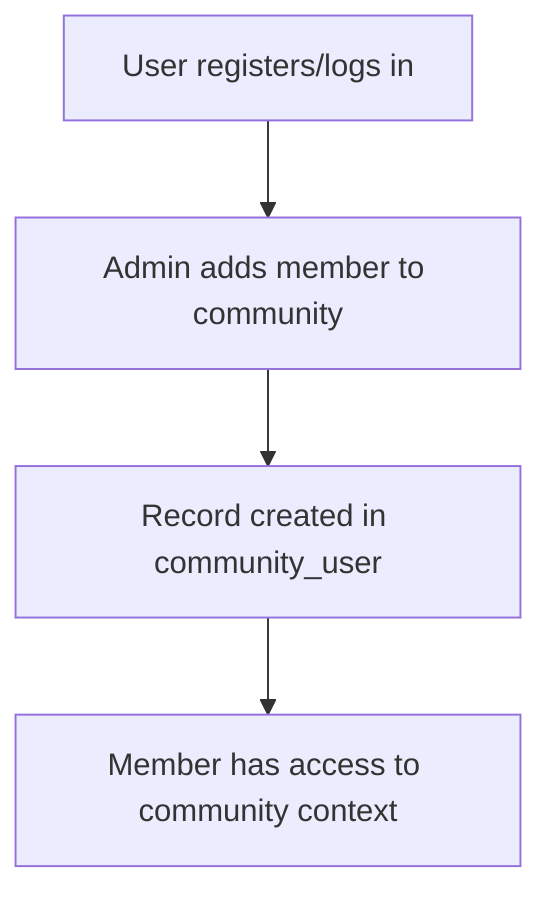

# Multi-tenant: Community

Based on the prayer-community structure (`communities` + `community_user`).
Each community is independent. A user can belong to more than one.

## Data Model

## Flow: Create Community

## Flow: Join Community

