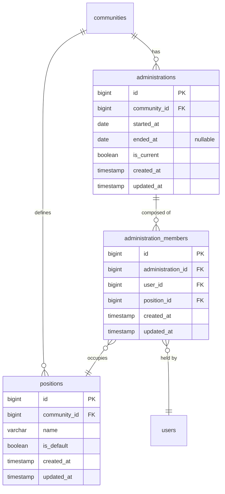
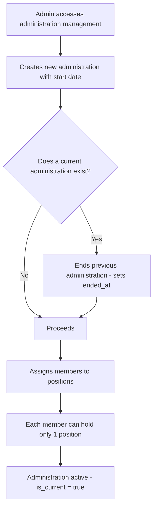
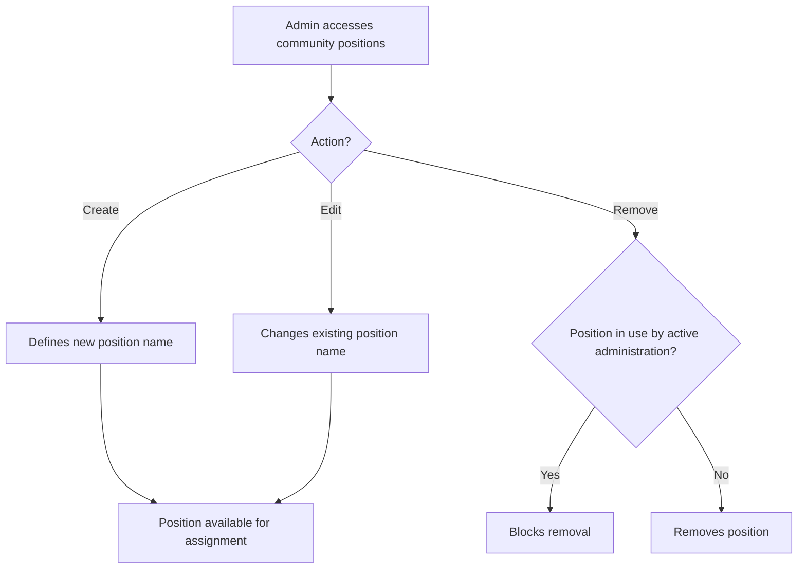
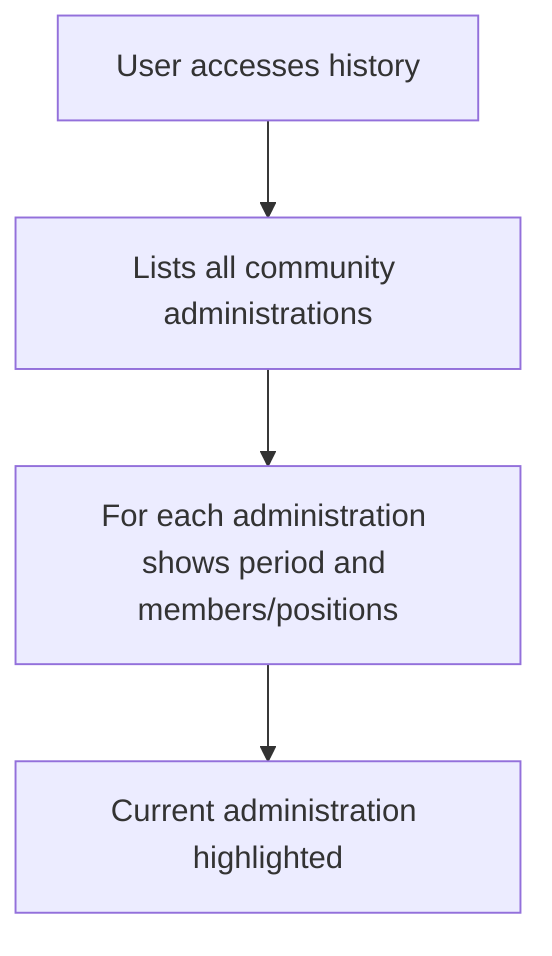

# Administrations and Positions

Each community can define its own positions (roles).
Default initial positions: President, Vice-President, Secretary, Treasurer.
An administration has a period (start/end). History is preserved.
A member can hold only one position at a time.

## Data Model

## Flow: Create New Administration

## Flow: Manage Positions

## Flow: Administration History

