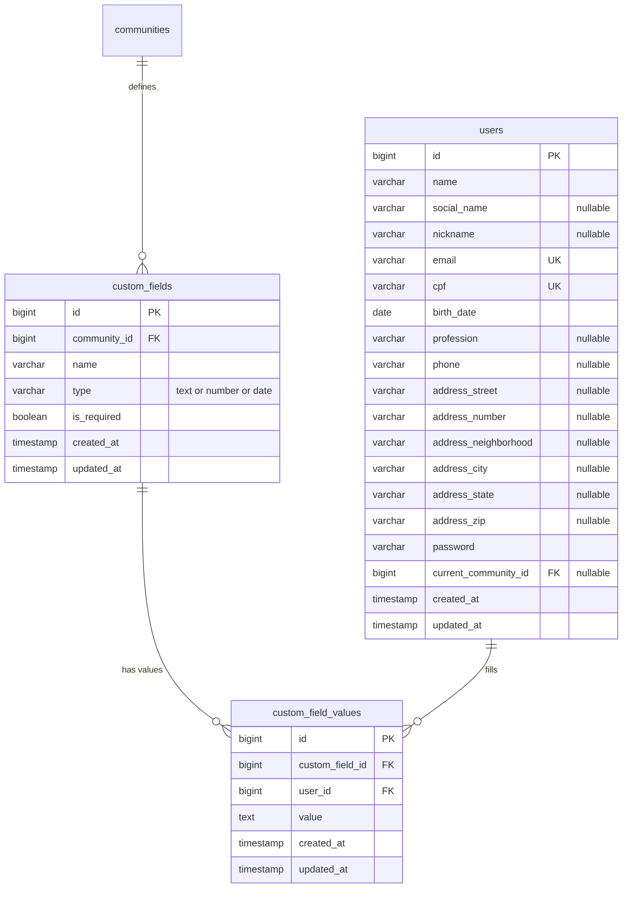
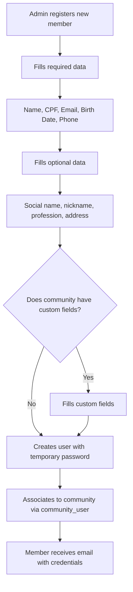
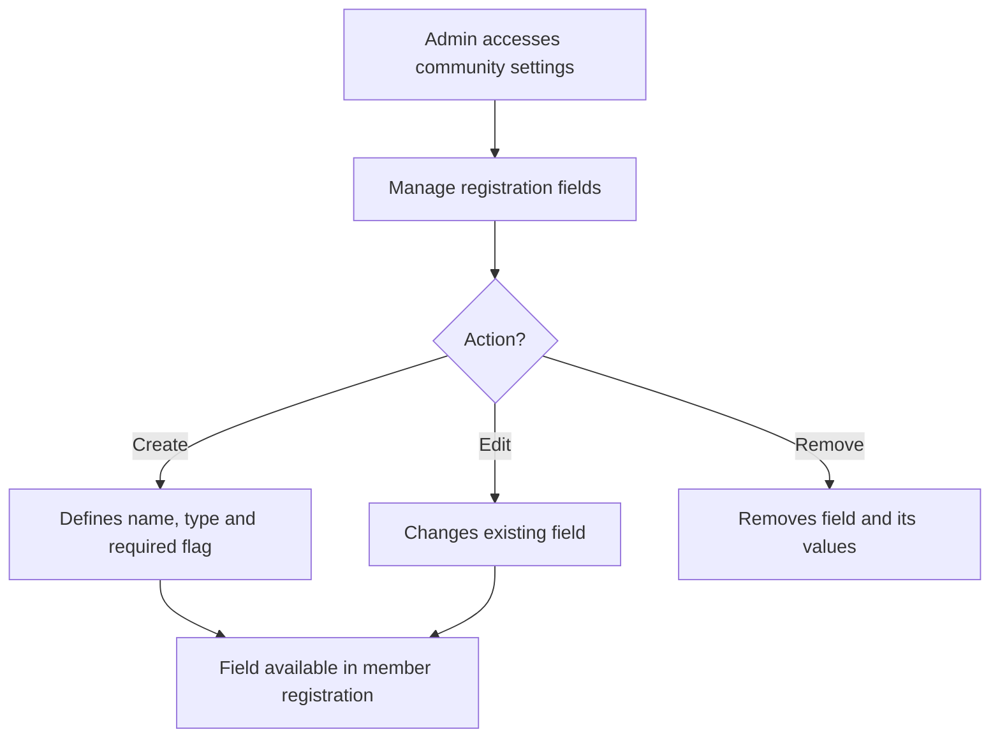

# Member Registration

Member = User with login. Required personal data + custom fields per community.
Each community can create additional fields (e.g. "Quilombola Registry", "CRQ") with name and type defined by admin.

## Data Model

## Flow: Register Member

## Flow: Admin Manages Custom Fields

