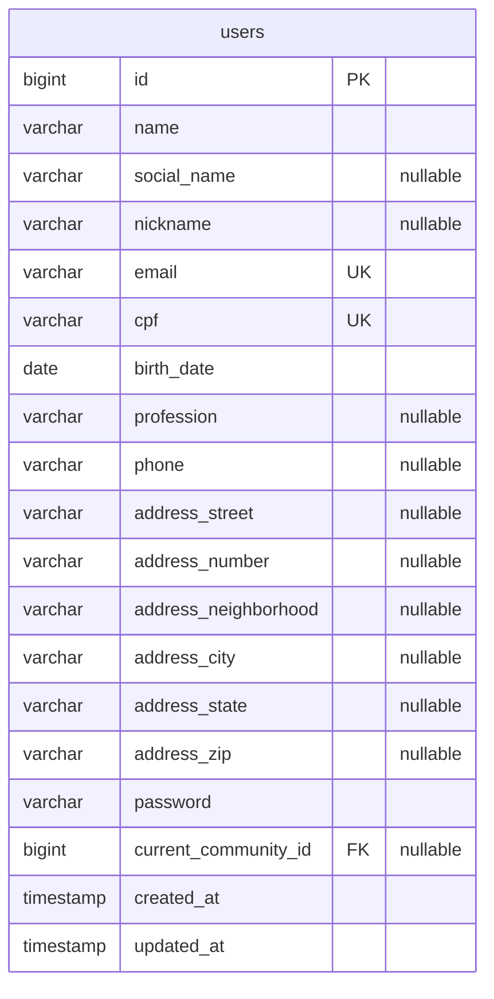
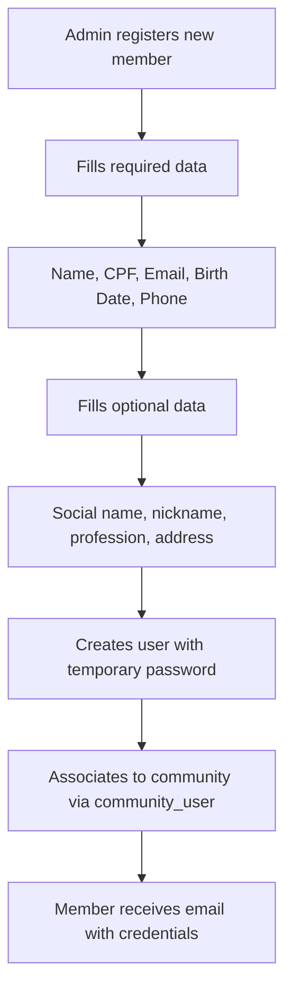

# Member Registration

Member = User with login. Required personal data per community.

## Data Model

```mermaid
erDiagram
    users {
        bigint id PK
        varchar name
        varchar social_name "nullable"
        varchar nickname "nullable"
        varchar email UK
        varchar cpf UK
        date birth_date
        varchar profession "nullable"
        varchar phone "nullable"
        varchar address_street "nullable"
        varchar address_number "nullable"
        varchar address_neighborhood "nullable"
        varchar address_city "nullable"
        varchar address_state "nullable"
        varchar address_zip "nullable"
        varchar password
        bigint current_community_id FK "nullable"
        timestamp created_at
        timestamp updated_at
    }
```

## Flow: Register Member

```mermaid
flowchart TD
    A[Admin registers new member] --> B[Fills required data]
    B --> C[Name, CPF, Email, Birth Date, Phone]
    C --> D[Fills optional data]
    D --> E[Social name, nickname, profession, address]
    E --> H[Creates user with temporary password]
    H --> I[Associates to community via community_user]
    I --> J[Member receives email with credentials]
```
