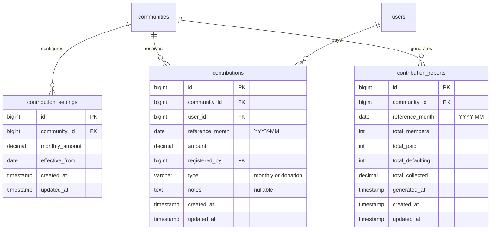
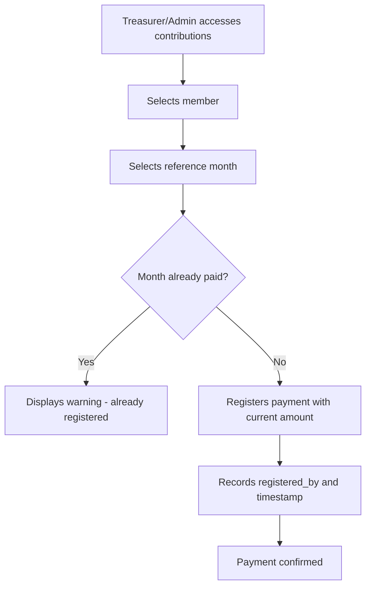
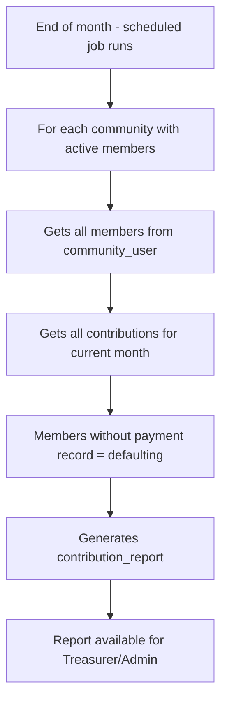
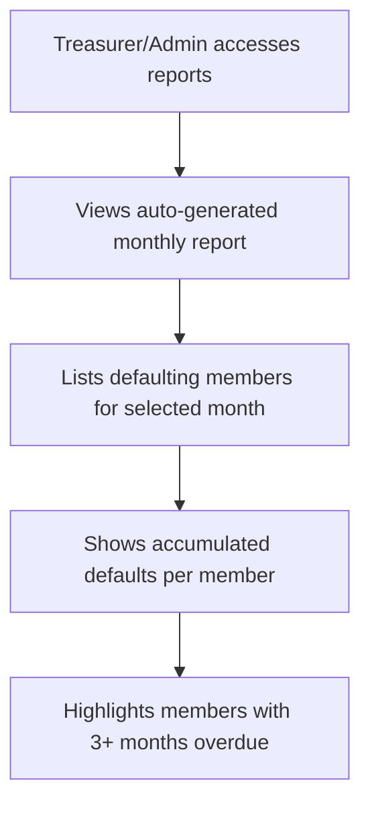
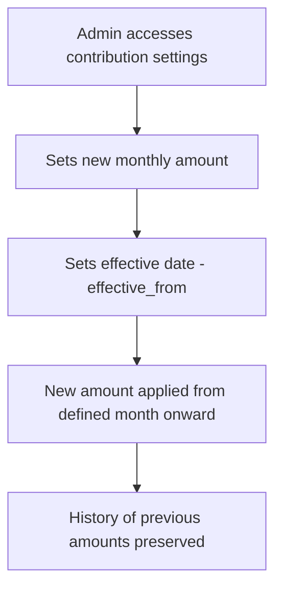
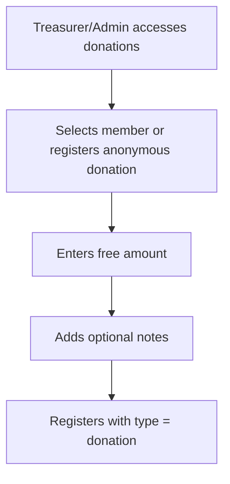
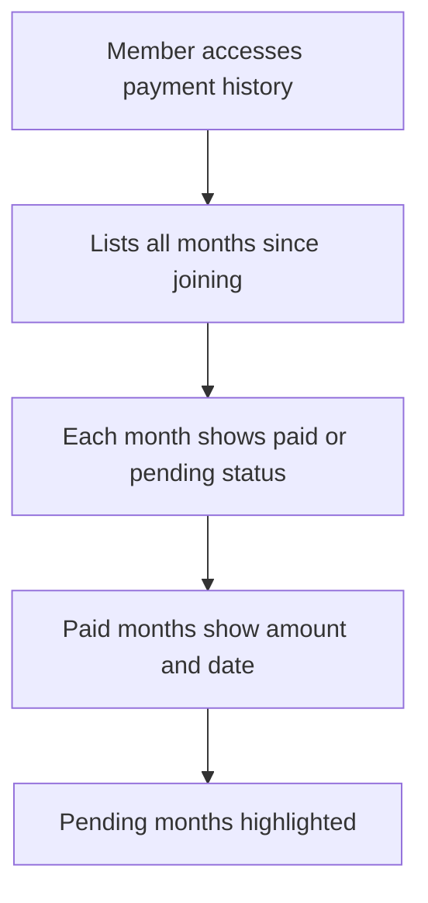

# Contributions and Donations

Mandatory monthly contribution with a fixed amount for all members.
Amount can be changed by meeting or community decision.
Donations are free, with no mandatory requirement.

The treasurer only registers members who paid. At the end of each month, an async job
automatically generates a default report by identifying members without a payment record.

## Data Model

## Flow: Register Monthly Payment

## Flow: Monthly Report Generation (Async Job)

## Flow: View Payment Defaults

## Flow: Change Contribution Amount

## Flow: Register Donation

## Flow: Member Views Own Payment History

