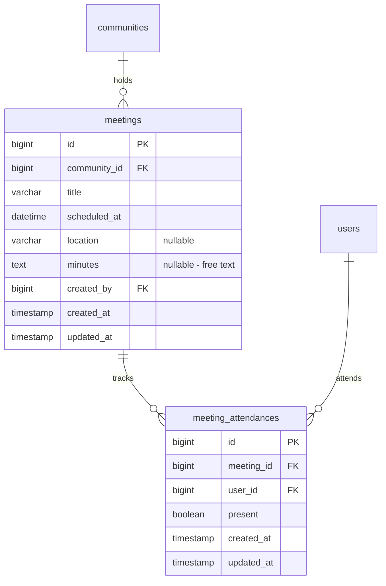
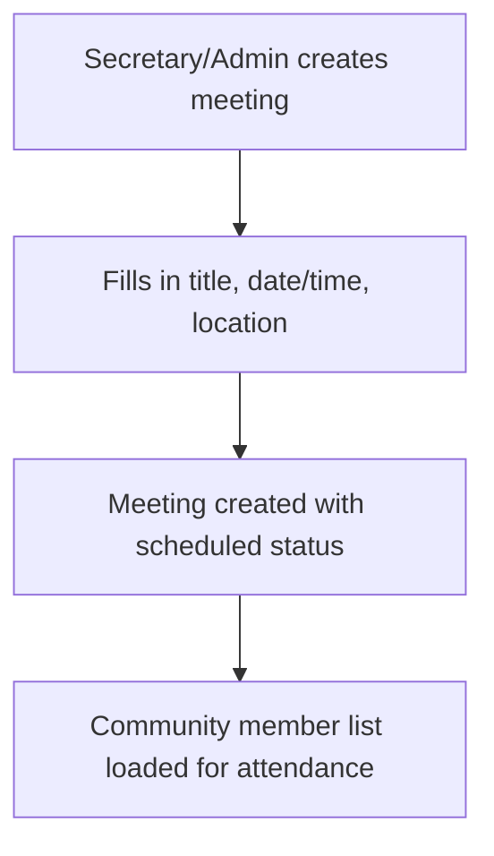
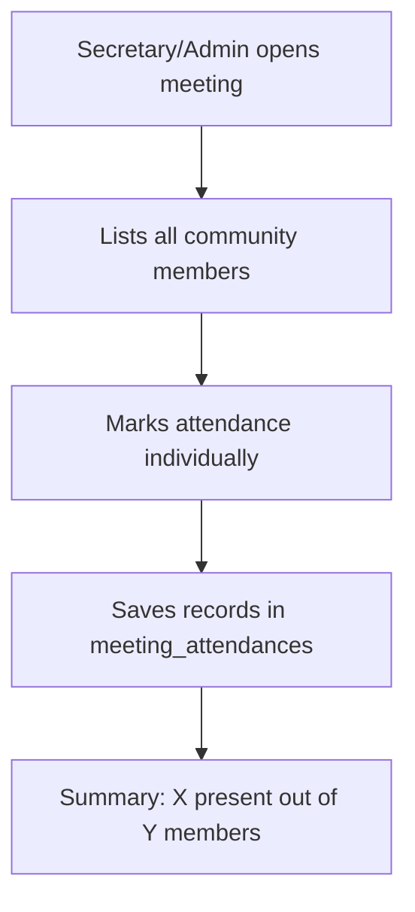
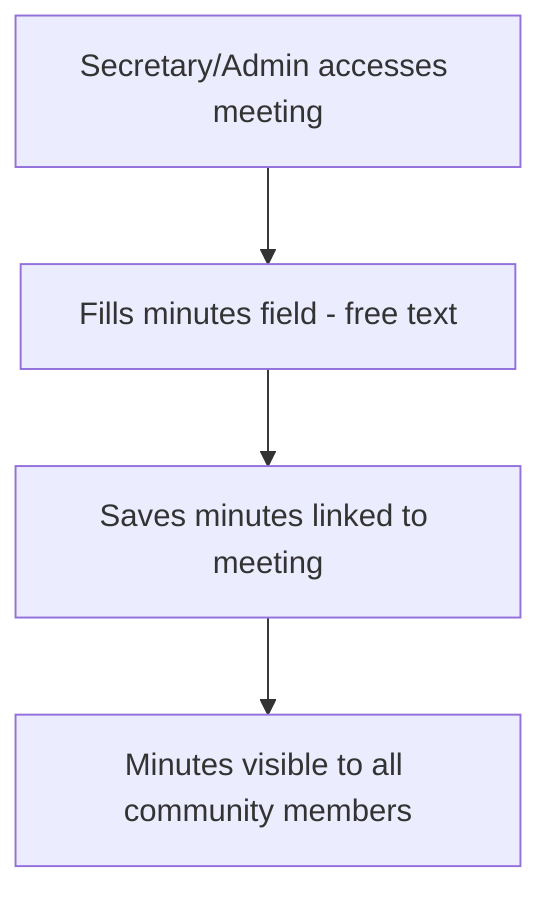
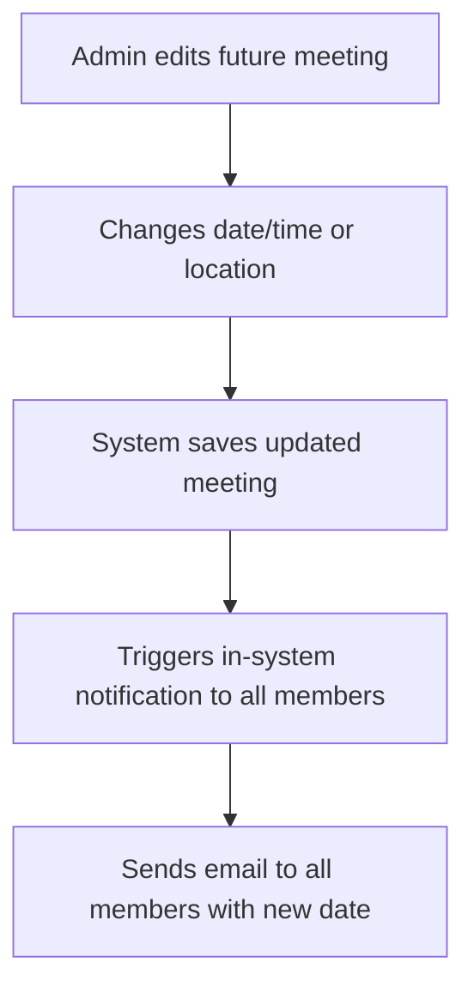
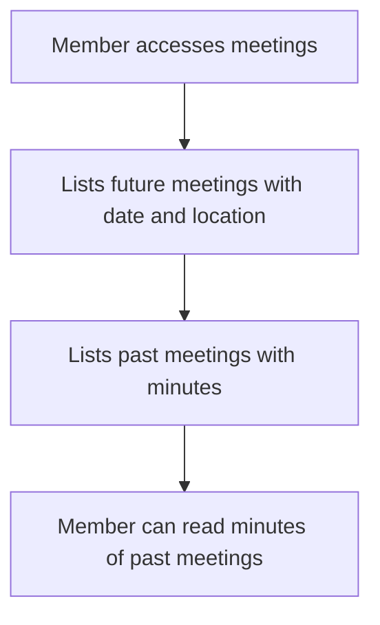
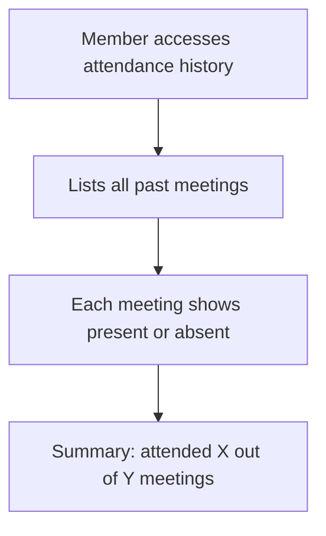

# Meetings and Minutes

Only secretaries or admins can create meetings.
Minutes are free text. Attendance is recorded manually by secretary or admin.

## Data Model

## Flow: Create Meeting

## Flow: Record Attendance

## Flow: Record Minutes

## Flow: Admin Changes Future Meeting Date

## Flow: Member Views Meetings

## Flow: Member Views Own Attendance History

