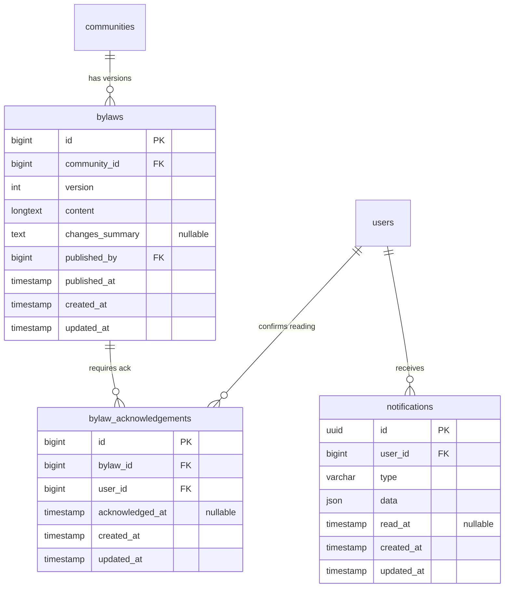
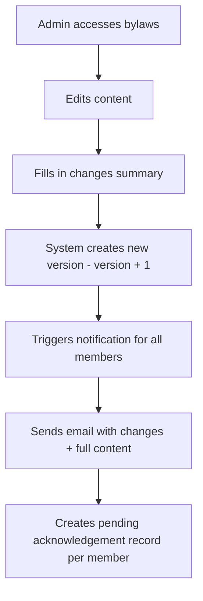
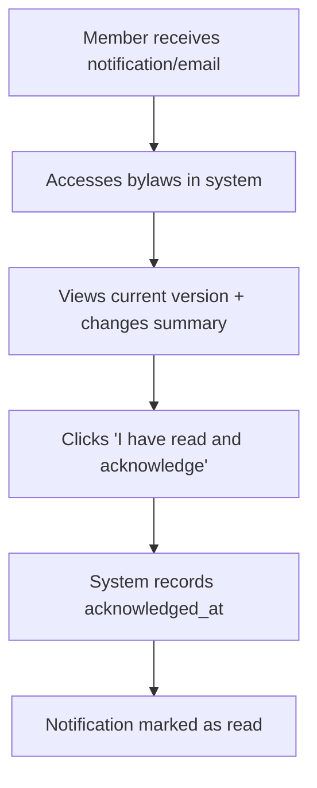
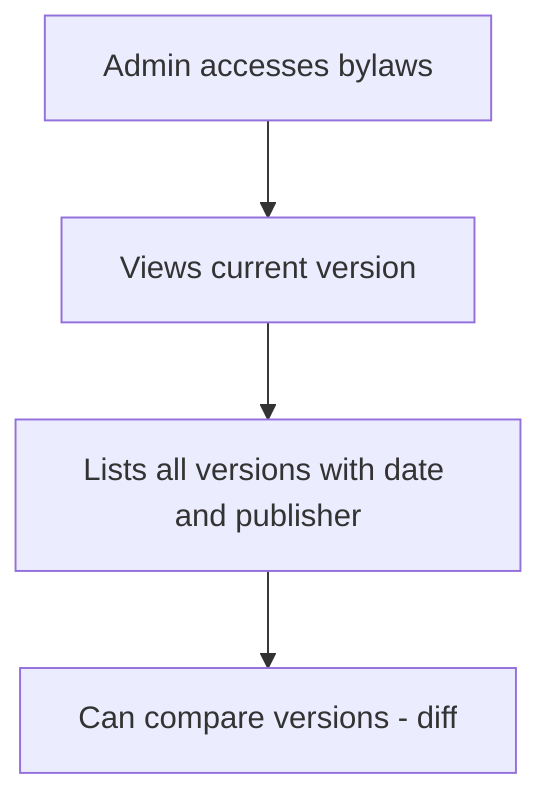
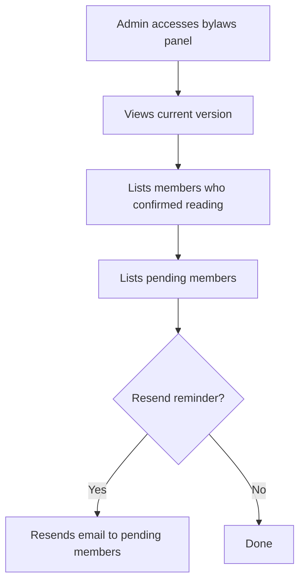
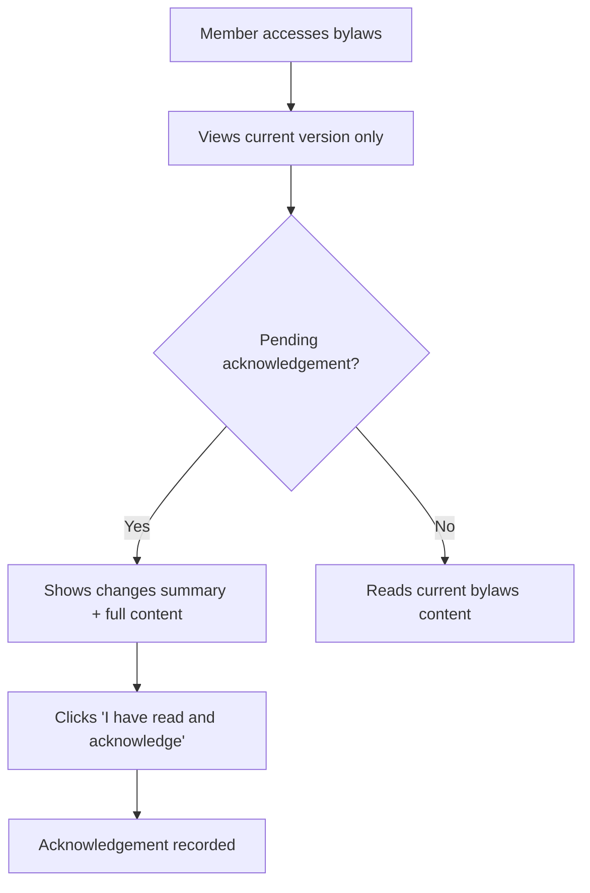

# Bylaws

Versioned with full history. Only admin can edit.
On edit, all members receive email + in-system notification with changes and full content.
Members must confirm reading ("I have read and acknowledge").

## Data Model

## Flow: Edit Bylaws

## Flow: Reading Confirmation

## Flow: Bylaws History (Admin Only)

## Flow: Admin Panel - Reading Status

## Flow: Member Views Bylaws

